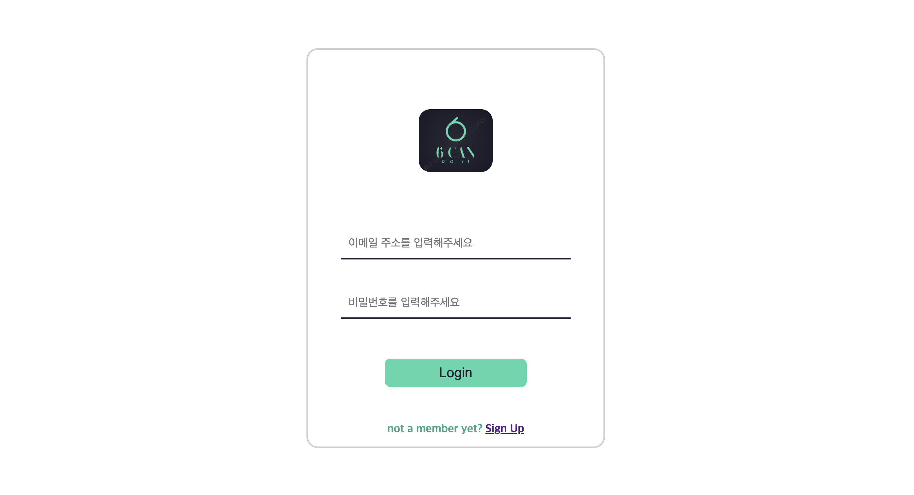
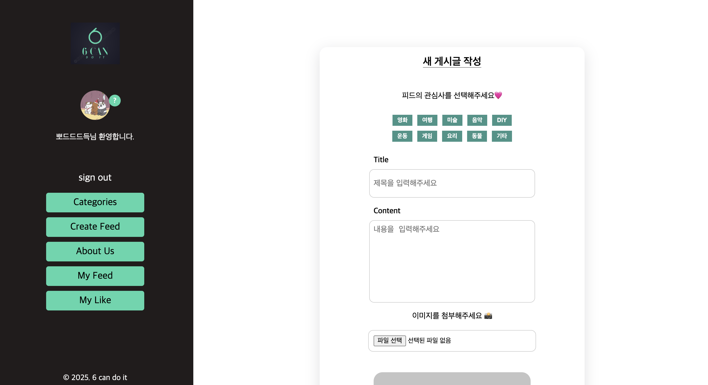
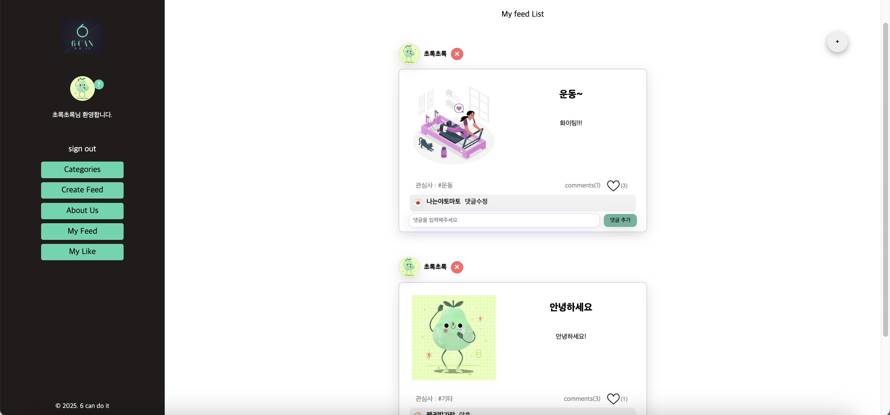

 

# 육캔두잇 - 너의 취미를 공유해봐! 🍷

육캔두잇은 (you can do it) + 저희 6조의 팀명이며, 나의 취미를 다른 사람들과 공유하고 소통하는 **취미 공유 & 소통** 서비스입니다.

 

⚽️ 육캔두잇 방문하기
 
https://newsfeed-6-can-do-it.vercel.app/

 

[💜 팀 노션](https://teamsparta.notion.site/6-_6-e69b9e28f9514071b59036dd05fb9a17) | [✔️ 코드컨벤션](https://teamsparta.notion.site/Code-Convention-1812dc3ef51481d8a11ec26cedfa1781)

 

## 주요 기능

<table>
  <tr>
    <td align="center">Main(메인페이지)</td>
    <td align="center">Sign-in (로그인 페이지)</td>
  </tr>
  <tr>
    <td align="center"></td>
    <td align="center"></td>
  </tr>
  <tr>
    <td align="center">Sign-up(회원가입 페이지)</td>
    <td align="center">Categories(카테고리)</td>
  </tr>
  <tr>
    <td align="center"></td>
    <td align="center"></td>
  </tr>
  <tr>
    <td align="center">Create-feed(게시글 작성 페이지)</td>
    <td align="center">About-us (팀 소개 및 관리자페이지)</td>
  </tr>
  <tr>
    <td align="center"></td>
    <td align="center"></td>
  </tr>
  <tr>
    <td align="center">My-feed(나의 총 게시글)</td>
    <td align="center">My-like (좋아요♥️ 게시글)</td>
  </tr>
  <tr>
    <td align="center"></td>
    <td align="center"></td>
  </tr>
</table>

 

## 1️⃣ 유저가 공유하고 싶은 취미 공유 및 소통 hub 제공

- 최신 피드로 올라오는 다양한 정보 제공
- 회원가입와 로그인을 통한 소통 Hub에 참여
- 게시글 작성 편의성 향상 (Main페이지에서 이동)
- 로그인을 통한 마이페이지 접근 및 수정

 

## 2️⃣ 네비게이션 바

- 유저 프로필, 로그인 상태 UX 편의성 향상
- 내가 쓴 게시물, 내가 좋아요한 게시물 볼 수 있는 페이지 이동
- 개발자 소개, 피드 작성, 카테고리 페이지 이동

 

## 3️⃣ 카테고리 페이지

- 회원가입 시, 설정한 3개의 나의 관심사 분야에 맞는 최신 피드 추천

 

## 4️⃣ 피드 생성 기능

- 피드 생성 시, 올린 피드에 관한 카테고리 설정

 

## 5️⃣ 댓글 & 좋아요 및 My Feed, My Like 모아보기

- 실시간 소통을 위한 피드에 댓글 입력/ 수정 기능
- 북마크(좋아요) 기능을 통한 모아보기 \_ My Like 페이지
- 내가 작성한 전체 게시글 모아보기 \_ My Feed 페이지

 

## 6️⃣ 관리자 페이지

- 개발팀만 접근 가능한 관리자 페이지 생성
- 개발자 목록 조회 및 개발자 프로필 제공
- 관리자 전용 버튼 및 관리자 페이지 이동
- 가입된 유저 삭제 권한 (관리자만 가능)
- Protected Route (admin-page)

 

## 👥 팀원 소개

| 이름   | GITHUB                                                                 | BLOG                                           |
| ------ | ---------------------------------------------------------------------- | ---------------------------------------------- |
| 구본승 | [meeseeks99](https://velog.io/@meeseeks99/posts)                       | [Velog](https://velog.io/@meeseeks99/posts)    |
| 김우경 | [arendt9797](https://github.com/arendt9797)                            | [Velog](https://velog.io/@arendt9797/posts)    |
| 문효진 | [Hyojin-Moon](https://github.com/Hyojin-Moon)                          | [Velog](https://velog.io/@6776ff/posts)        |
| 송제우 | [PomegranateBlue](https://github.com/PomegranateBlue?tab=repositories) | [tistory](https://redpome.tistory.com/)        |
| 이지은 | [izzienote](https://github.com/izzienote)                              | [tistory](https://izzie-note.tistory.com/)     |
| 최수진 | [verdantgreeny](https://github.com/verdantgreeny)                      | [Velog](https://velog.io/@verdantgreeny/posts) |
